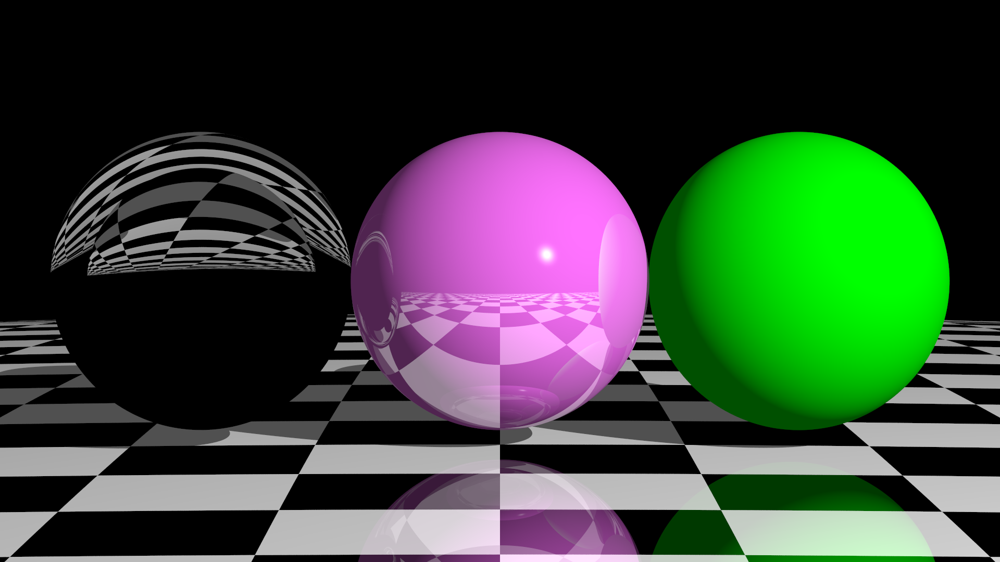

# ray-tracer

Ray tracing engine in Rust.

## Renders




## Instructions

Usage: ray-tracer [OPTIONS] --scene <SCENE>
```
Options:
  -s, --scene <SCENE>            Path to scene YAML file.
  -f, --format <FORMAT>          [default: png] [possible values: png, ppm]
  -n, --image-name <IMAGE_NAME>  [default: image]
      --width <WIDTH>            [default: 1280]
      --height <HEIGHT>          [default: 720]
      --samples <SAMPLES>        [default: 300]
      --max-depth <MAX_DEPTH>    Maximum number of bounces per ray. [default: 100]
  -h, --help                     Print help
```

## Defining a scene

look for examples in ./scenes/examples
```
types
- Vector: [f64, f64, f64]
- Colour: [f64, f64, f64]
    - colour in rgb format
- Object: enum
    - !Sphere
    - !Plane
    - !Box
    - !Disk
    - !Cylinder
    - min: f64
        - default: -infinity
    - max: f64
        - default: infinity
    - closed: boolean
    - !Cone
    - min: f64
        - default: -infinity
    - max: f64
        - default: infinity
    - closed: boolean
- Material: enum
    - !Glass
    - !Metal
    - colour: Colour
    - pattern: Option<Pattern>
    - !Plastic
    - colour: Colour
    - pattern: Option<Pattern>
    - !Custom
    - colour: Colour
    - pattern: Option<Pattern>
    - ambient: f64
        - default: 0.1
    - diffuse: f64
        - default: 0.9
    - specular: f64
        - default: 0.9
    - shininess: f64
        - default: 200.0
    - reflective: f64
        - default: 0.0
    - transparency: f64
        - default: 0.0
    - refractive_index: f64
        - default: 1.0
- Pattern:
    - type: enum
    - !Stripes
    - !Gradient
    - !Rings
    - !Checkers
    - colour_a: Colour
    - colour_b: Colour
    - transform: Option<List<Transform>>
- Transform: enum
    - !Translate: Vector
    - !Scale: Vector
    - !Scale_uniform: f64
    - !Rotate_x: f64
    - !Rotate_y: f64
    - !Rotate_z: f64

A scene can be defined by a .yaml file.
- camera:
  - look_from: Vector
    - default: [0.0, 0.0, 0.0]
  - look_at: Vector
    - default: [0.0, 0.0, -1.0]
  - vup: Vector
    - default: [0.0, 1.0, 0.0]
    - vector considered to be "upwards"
  - vfov: f64
    - default: 90.0
    - field of view
  - aperture: integer
    - default: 0
    - size of the lens, bigger is more light, smaller less light
  
- Background: Colour

- Lights (list)
  - position: Vector
  - colour: Colour

- Objects (list)
  - type: Object
  - material: Material
  - transform: Option<List<Transform>>
  
```